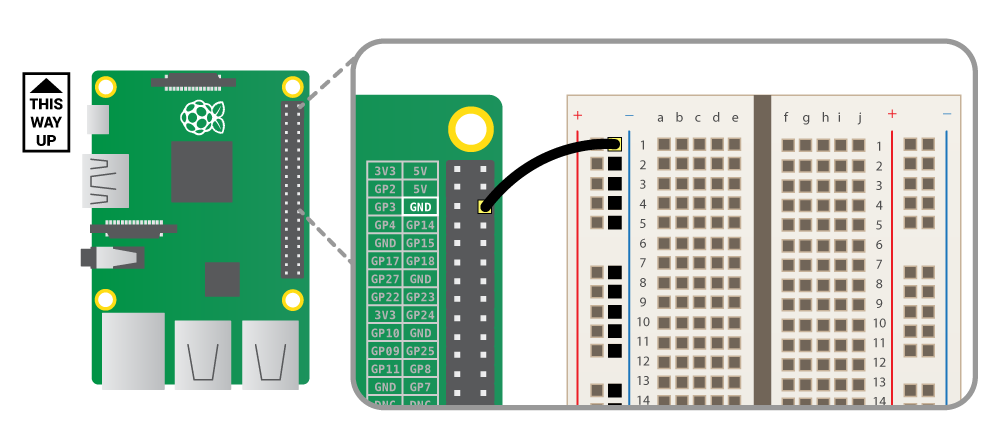

# GPIO Music Box

Wire up a series of buttons that play particular sounds when pressed

## Getting started

First we'll create a Python program, import the GPIO and PyGame libraries and play a test sound file.

1. Boot your Pi and open LXTerminal from the Desktop.

1. Type the command `ls` and you should see the files and folders in your home directory.

1. There should be a folder called `music-box`. If this is not the case please follow the instructions in the [setup page](setup.md).

1. Enter the folder with `cd music-box`

1. Type `ls` and you shound see a `sounds folder`

1. Type `ls sounds` and you should see the example sound files.

1. Create a new Python file with `touch music-box.py`

1. Open the Python file in IDLE with the command `sudo idle music-box.py &`

    This opens IDLE, the Python application, with super user permissions as you'll need these to use GPIO.

    You'll see a Python prompt window (it will say some information about Python and then a new line starting with `>>>`, and another window which will be blank.

1. In the blank window, enter the following code to get started:

    ```python
    import pygame.mixer

    pygame.mixer.init()

    sound = pygame.mixer.Sound("sounds/note_a.wav")
    
    while True:
        sound.play()
    ```

    Here, we import the audio mixer module of the PyGame library and initialise it.

    Then we create a reference to one of the example sound files.

    The `while True` is a continuous loop containing a command to play the sound file. It will keep playing the sound repeatedly until the program is terminated.

1. Save the file with `Ctrl + S` and run with `F5`.

    It should play the sound repeatedly.
    
1. Click in to the Python prompt window and press `Ctrl + C` on the keyboard to force it to end.

    If you can't hear the sound, or it's coming out of the wrong speakers, you can change your audio configuration. Return to the terminal window and type the following command:

    ```bash
    amixer cset numid=3 2
    ```

    to switch audio to the headphone jack, or

    ```bash
    amixer cset numid=3 1
    ```

    to switch to HDMI.

    You only need to do this if your audio is coming out of the wrong speakers.

## Wire up first button

Now we've configured the audio and tested playing sound in Python, we'll connect the GPIO button.

1. Find a ground pin (marked `GND`) on the following diagram of the Raspberry Pi's pin layout:

    |-------:|:-------|
    |    3V3 | 5V     |
    |  GPIO2 | 5V     |
    |  GPIO3 | GND    |
    |  GPIO4 | GPIO14 |
    |    GND | GPIO15 |
    | GPIO17 | GPIO18 |
    | GPIO27 | GND    |
    | GPIO22 | GPIO23 |
    |    3V3 | GPIO24 |
    | GPIO10 | GND    |
    |  GPIO9 | GPIO25 |
    | GPIO11 | GPIO8  |
    |    GND | GPIO7  |
    |    DNC | DNC    |
    |  GPIO5 | GND    |
    |  GPIO6 | GPIO12 |
    | GPIO13 | GND    |
    | GPIO19 | GPIO16 |
    | GPIO26 | GPIO20 |
    |    GND | GPIO21 |

    Note that if you have an older Raspberry Pi model, you'll only have 26 pins but they are the same layout, starting from 
1. Attach a wire to a ground pin on the Raspberry Pi and connect it to the ground rail on your breadboard like so:

    

1. Place the button on the breadboard and connect one of its feet to the ground rail.

1. Connect the button's other foot (on the same side) to GPIO pin 2 like so:

    

## Connect first button to sound file

Now we've connected a GPIO button, we'll make the sound play when the button is pressed.

1. Return to the code window and amend the code to add the GPIO library and set up pin 2 so it looks like this:

    ```python
    import pygame.mixer
    import RPi.GPIO as GPIO

    pygame.mixer.init()
    GPIO.modmode(GPIO.BCM)
    GPIO.setwarnings(False)

    GPIO.setup(2, GPIO.IN, GPIO.PUD_DOWN)

    sound = pygame.mixer.Sound("sounds/note_a.wav")
    ```

    This sets up GPIO pin 2 as an input, so you can trigger an event with the button.

1. Now add a function for playing the sound. This will be the code than runs when the button is pressed:

    ```python
    def play(pin):
        print("playing")
        sound.play()
    ```

    The `print` will tell you when the function has been called, so you know what's going on.

1. Create a GPIO event that will call the `play` function when the button is pressed:

    ```python
    GPIO.add_event_detect(2, GPIO.FALLING, callback=play, bouncetime=1000)
    ```

    The arguments passed to the function are:
    
    - the GPIO pin number (`2`)
    - the type of voltage change (`FALLING`)
    - the function to be used as the callback (`play`)
    - the amount of time allowed between button presses (`1000` milliseconds)

1. Add a line to print `ready` once it's all been set up and add a `while True` loop to wait for a button press:

    ```python
    print("ready")

    while True:
        pass
    ```

1. Run the program again and once you see `ready` printed to the screen, press the button and you should hear the sound played. Each time you press the button it should print `playing` to the screen and play the sound.

    If you do not see the word `playing` when you press the button, check you have it wired to the ground rail and pin 2 and that the cables are securely connected.

## Connect second button


## Connect second button to sound file


## Connect more buttons


## Add more sounds and buttons to code


## Make a music box

Leaving the code as it is, you could make a box and 
